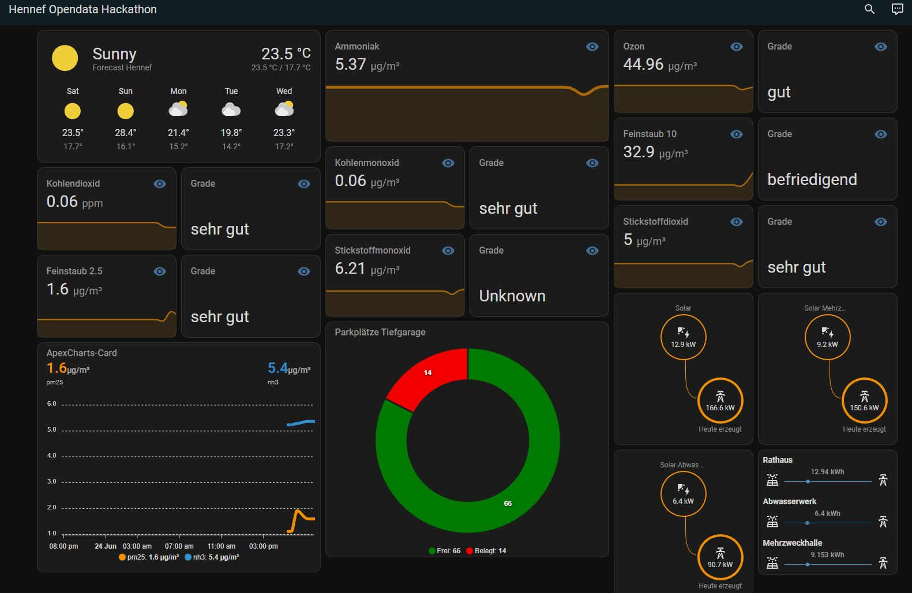

## geoportal\_scrapper\_hennef

A scrapper for data from geoportal provided by Hennef  

This is a Home Assistant Project specificly designed for the city Hennef (NRW/Germany).

It is a json scrapper that will get values by Hennef and creates sensors and devices based on attribute dictionaries.

Used URLs are defined here: [Geoportal Links](./custom_components/geoportal_scrapper/__init__%20.py#L18-L21)

When changing them the [category definition](./custom_components/geoportal_scrapper/hub.py#L42-L43) might break so make changes accordingly.

Information about possible device classes and unit of measurements can be found here:

1.  [Home Assistant Const](https://github.com/home-assistant/core/blob/dev/homeassistant/const.py)
2.  [Home Assistant Sensors](https://github.com/home-assistant/core/blob/2023.6.3/homeassistant/components/sensor/const.py)
