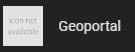

## geoportal\_scrapper\_hennef

A scrapper for data from geoportal provided by Hennef

This is a Home Assistant Project specificly designed for the city Hennef (NRW/Germany).

It is a json scrapper that will get values by Hennef and creates sensors and devices based on attribute dictionaries.

Used URLs are defined here: [Geoportal Links](./custom_components/geoportal_scrapper/__init__%20.py#L18-L21)

When changing them the [category definition](./custom_components/geoportal_scrapper/hub.py#L42-L43) might break so make changes accordingly.

Information about possible device classes and unit of measurements can be found here:

1.  [Home Assistant Const](https://github.com/home-assistant/core/blob/dev/homeassistant/const.py)
2.  [Home Assistant Sensors](https://github.com/home-assistant/core/blob/2023.6.3/homeassistant/components/sensor/const.py)

 
Used custom cards in the preview:

[Power Flow Card Pluss](https://github.com/flixlix/power-flow-card-plus)  
[ApexCharts Card](https://github.com/flixlix/power-flow-card-plus)  
[Energy Overview Card](https://github.com/flixlix/power-flow-card-plus)

---

## How to install

#### Installation via [HACS](https://hacs.xyz/docs/setup/download/)

1. Go to your HACS-Integrations page
2. Click on the three points in the top right corner
3. Click on Custom Repositories
4. Paste this url: https://github.com/Kaladasas/geoportal_scrapper_hennef
5. Select Integration and click on Add
6. Click on Install

#### Manually

Copy the content of the `custom_components`\-Folder from this repository to the `custom_components` folder of your home-assistant installation.

If you don´t have that folder in your installation you can create it on the same level where you find the `config.yaml`.

Doing this inside the WebUI is possible via the Add-On [**File Editor**](https://my.home-assistant.io/redirect/supervisor_store)**.**

---

### **\*\*\*You have to restart your home instance after installing\*\*\***

### \*\*\*After the installation you have add the integration under **Devices & Services\*\*\***

---